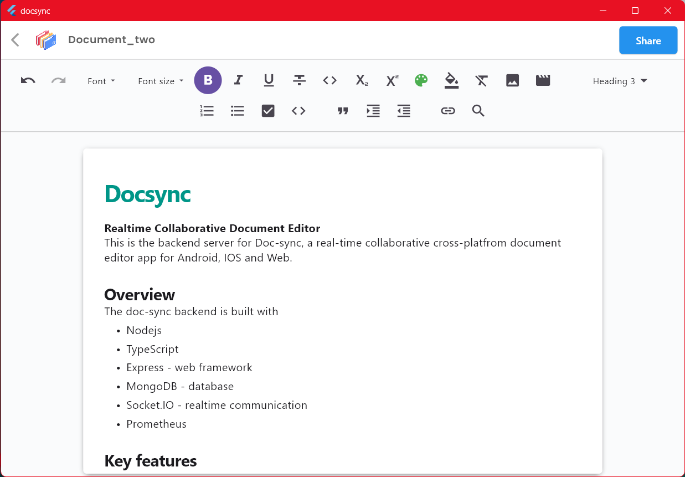
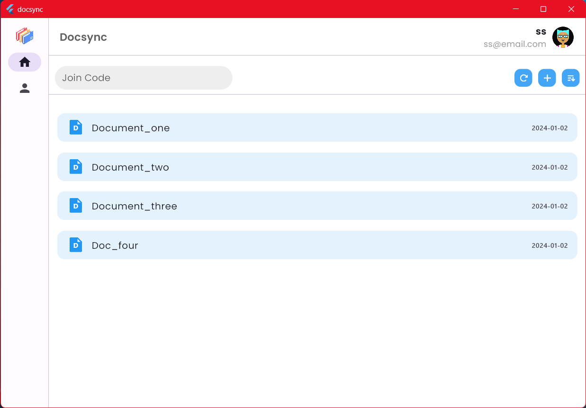
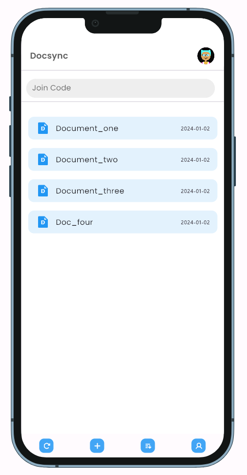
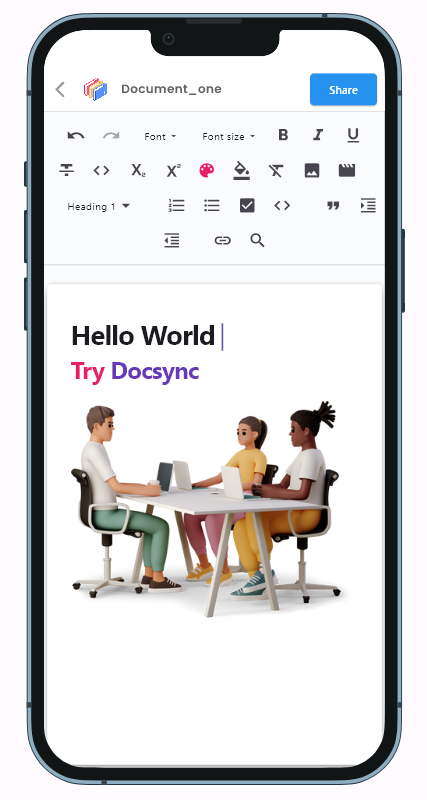

  
# Docsync
**Realtime Collaborative Document Editor**

This is the client application for Docsync, a real-time collaborative cross-platform document editor available on Android, iOS, Web, and Desktop.

### Tech Stack

> **Frontend**  
> Flutter, Dart, Riverpod, Retrofit, Dio, Quill, Socket.IO, Freezed, GoRouter 
> 
> 


> **Backend**:  
> Typescript, Node.js, Express, MongoDB, Socket.IO, Docker, Grafana, Prometheus  
>
>   


### Key features:

- User authentication and access control
- Realtime collaborative editing using Socket.IO
- Document CRUD (create, read, update, delete) operations
- User profiles and management
- Cross-platform
- Build using clean architecture
  
## Screenshots

### Desktop and Web
  
  


### Mobile
  


### Prerequisites
- Flutter SDK
- Dart SDK  
  
### Installation
```bash
# Clone the repo
git clone https://github.com/subrotokumar/doc-sync.git
cd doc-sync

# Install dependencies
flutter pub get

# Configure backend connection in lib/constants.dart

# Run the app
flutter run
```

**Supported Platforms:**
- Android
- iOS
- Web
- Desktop

### License
MIT